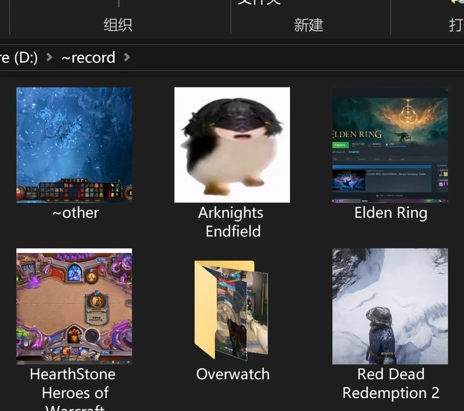

# Folder-Thumb-for-Windows

Generate Windows folder thumbnails from the first supported image found in each subfolder.

## Demo

<a href="https://www.bilibili.com/video/BV1heDdBNEVU"></a>

[Watch the introduction video on Bilibili.](https://www.bilibili.com/video/BV1heDdBNEVU)

## Getting Started

1. Download the repository as a ZIP file, or clone it:

```powershell
git clone https://github.com/adadsws/Folder-Thumb-for-Windows.git
```

2. Keep `run.bat`, `config.ini`, and the `scripts` folder together in the project directory.
3. Double-click `run.bat`.

## Requirements

- Windows 10 or Windows 11
- Windows PowerShell 5.1
- File Explorer set to Large icons or Extra large icons

## Usage

First choose a mode:

- `1` — Set folder thumbnails
- `2` — Restore default folder icons
- `0` — Exit

Then choose a target:

- `1` — Process subfolders in the project directory containing `run.bat`
- `2` — Enter a custom absolute path
- `3` — Load multiple paths from `config.ini`

Supported images: `.jpg`, `.jpeg`, `.png`, `.bmp`, `.gif`, and `.webp`.

## Configuration

Edit `config.ini` to control image fitting and define reusable target folders:

```ini
[settings]
; crop fills the square and may trim the image edges.
; letterbox keeps the whole image and adds black padding.
fit=crop

[paths]
; Use one absolute UTF-8 path per line.
path=C:\Pictures\Albums
path=D:\Gallery
```

Use `fit=crop` to fill the 256×256 icon or `fit=letterbox` to preserve the complete image. Add one `path=` line for every folder you want target option `3` to process.

## How It Works

The script recursively scans the selected folder's subfolders and uses the first supported image found in each one. It creates a 256×256 `.ico`, writes the folder icon setting to `desktop.ini`, and restarts Explorer to refresh the result. Restore mode sends `desktop.ini` and icon files to the Windows Recycle Bin; if recycling is unavailable, the files are kept and a warning is shown. Regenerating thumbnails still permanently removes obsolete generated `fi_*.ico` files to avoid filling the Recycle Bin with temporary icons.
